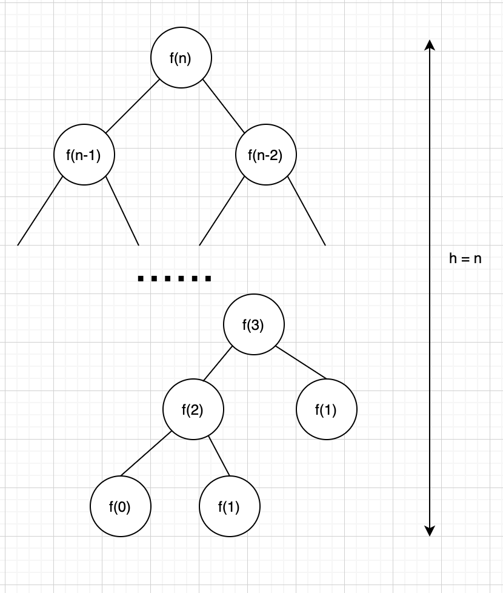

# Algorithm-Complexity
### _Creator: X.Cuong Le_


### 1. Tính toán độ phức tạp thuật toán cho bài toán Fibonacci sử dụng vòng lặp (_Fibonacci by Loop_)**

```javascript
for (let i = 2; i<=n; i++){
        answer = last + nextToLast;
        nextToLast = answer;
        last = answer;
}
```
Dễ thấy rằng độ phức tạp của bài toán là tuyến tính O(n). Cụ thể hơn, số phép so sánh là n (so sánh với điều kiện i<=n), số phép gán là 3n + 1 (kể cả những phép gán khởi tạo ban đầu cho vòng for)

### Bảng kiểm thử black box trên lí thuyết:
|STT|Giá trị n| Số phép so sánh cần thực hiện|Số phép gán cần thực hiện|
|---|---|---|----|
|1|5|5|16 |
|2|7|7|22 |
|3|9|9|28 |
|4|12|12|37 |
|5|15|15|46 |
|6|18|18|55 |
|7|25|25|76 |
|8|30|30|91 |
|9|40|40|121 |
|10|45|45|136|

Cài đặt giải thuật với biến đếm phép gán và phép so sánh ta được:
|STT|Giá trị n| Kết quả|Số phép gán đã thực hiện| Số phép so sánh đã thực hiện|
|---|---|---|----|----|
| 1|5|8|16|5 |
| 2|7|21|22|7 |
| 3|9|55|28|9 |
| 4|12|233|37|12 |
| 5|15|987|46|15 |
| 6|18|4181|55|18 |
| 7|25|121393|76|25 |
| 8|30|1346269|91|30 |
| 9|40|165580141|121|40 |
| 10|45|1836311903|136|45 |

> Kết luận: Bảng dự đoán Blackbox khớp vài bảng chạy thực tế trong bài toán giải Fibonacci bằng vòng lặp.
### **2. Tính toán độ phức tạp thuật toán cho bài toán Fibonacci sử dụng đệ quy (_Fibonacci by Recursion_)**

### **Tính toán trên lí thuyết:**
```javascript
fibonacci = (n) => {
    if (n <= 1)
        return 1;
    return fibonacci(n-1) + fibonacci(n-2);
}
console.log(fibonacci(5));
```
### Theo giải thuật trên, để tính được f(n) ta cần gọi hàm đệ quy để thực hiện phép toán cộng cho f(n-1) và f(n-2). Dễ dàng nhận thấy số các phép toán (+) của bài toán đệ quy trên là 1/2 số các nút của cây đệ quy trong hình vẽ phía dưới.



Từ lập luận đó, ta có thể suy ra được: 
> Trên lý thuyết số phép toán cộng cần thực hiện là: $2^{n-2}$

(Do lớp lá của cây chỉ có 2 node và có thể tính cho 2 node thiếu bên phải của lớp thứ liền kế lớp lá để ra được kết qủa $2^{n-2} - 1$)

Dựa vào điều kiện bài toán, số phép tính so sánh (<=1) sẽ bằng số node lá của cây cộng với tổng số node trên cây:
> Trên lý thuyết, số phép so sánh là: 2^(n-1)

_Các công thức trên chỉ áp dụng khi thoả điều kiện __n>=2___

### Các giá trị kiểm thử hộp đen trên lí thuyết
|STT|Giá trị n|Số phép cộng cần thực hiện 2^(n-2)-1|Số phép so sánh cần thực hiện 2^(n-1)|
|---|---|---|----|
| 1| 5| 7| 16 |
| 2| 7| 31| 64 |
| 3| 9| 127| 256 |
| 4| 12| 1023| 2048 |
| 5| 15| 8191| 16384 |
| 6| 18| 65535| 131072 |
| 7| 25| 8388607| 16777216 |
| 8| 30| 268435455| 536870912 |
| 9| 40| 274877906943| 549755813888 |
| 10| 45| 8796093022207| 17592186044416

### **Kết quả thực tế:**
Bảng tính ghi kết quả số lượng các phép so sánh (compare) và số phép cộng (addition) sau khi chạy giải thuật 
|STT|Giá trị n|Kết quả trả về| Số phép so sánh đã thực hiện|Số phép cộng đã thực hiện|
|---|---|---|----|----|
|1| 5| 8| 15| 7 |
|2| 7| 21| 41| 20 |
|3| 9| 55| 109| 54|
|4| 12| 233| 465| 232 |
5|15|987|1973| 986 |
6|18| 4181| 8361| 4180 |
7|25| 121393| 242785| 121392 |
8|30| 1346269| 2692537| 1346268 |
9|40| 165580141| 331160281| 165580140|
10|45| 1836311903|3672623805|1836311902|

> Kết luận: Có thể thấy rằng kết quả dự đoán trên lí thuyết về số lượng các phép toán và phép so sánh cần thực hiện trên lí thuyết khác hơn hẳn so với số lượng thực cần. 